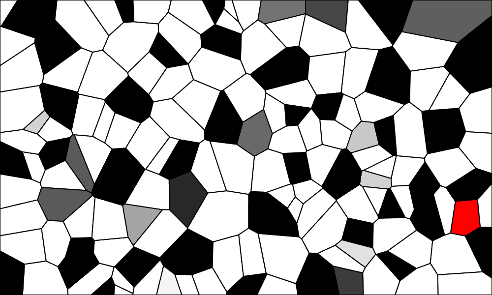

# CellularAutomataVoronoi
Cellular Automata on Dynamic Voronoi pattern
https://sentientdragon5.github.io/CellularAutomataVoronoi/

The goal was to create a cellular automata on a dynamic grid that changed number of sides.

Based off of Dan Shiffman's example
